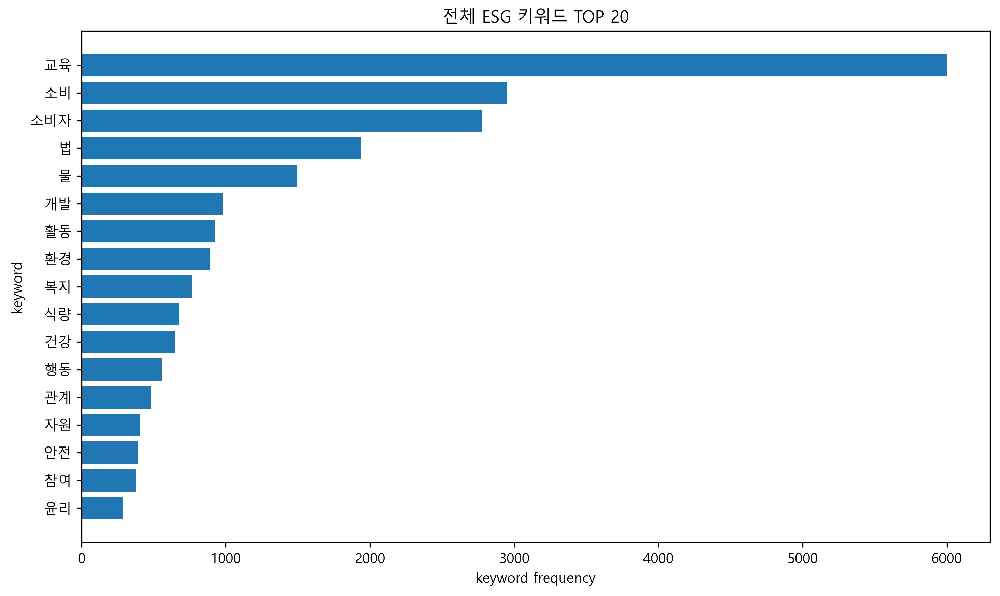
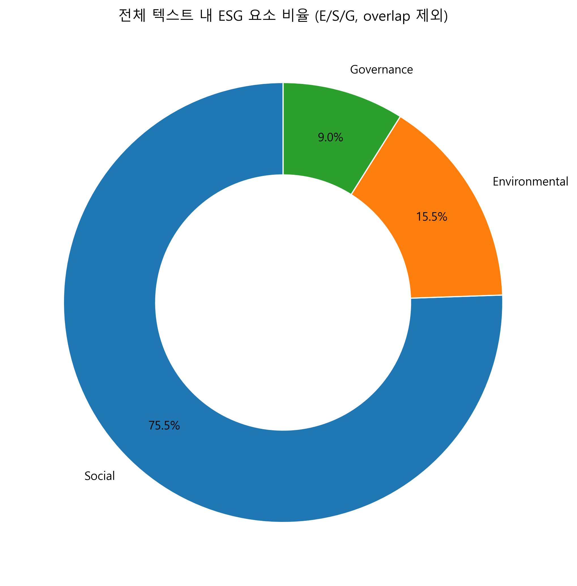
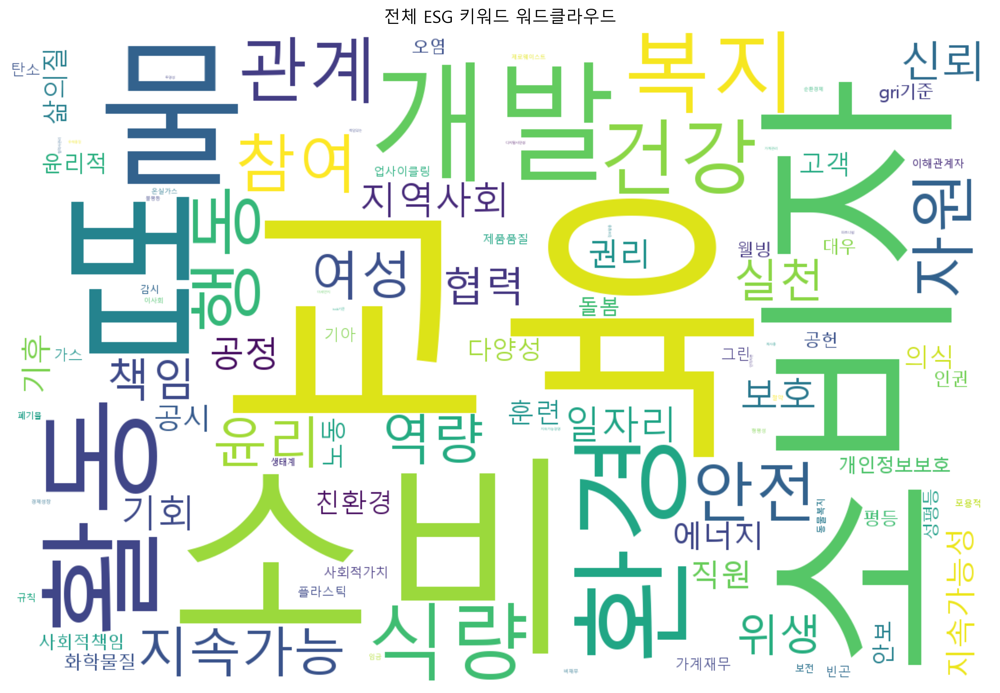

# 수도권 대학 생활과학계열 ESG 키워드 텍스트 마이닝

> 연구의뢰 프로젝트 | 단독 수행 | 18개 대학 · 1,054건

[](https://python.org)
[]()
[]()

---

## 프로젝트 배경

ESG(Environmental·Social·Governance) 경영 기조가 사회 전반으로 확산되면서 교육 기관의 ESG 교육 현황을 진단하려는 수요 증가. 그러나 대학 교육 콘텐츠에 ESG가 얼마나, 어떤 방식으로 반영되어 있는지를 실증적으로 분석한 연구는 부재.

수도권 18개 대학 생활과학계열 홈페이지 텍스트를 기반으로 ESG 키워드 분포와 계열별 서술 특성을 탐색하는 예비조사 연구.

---

## 문제 상황

대학 교육 현황 진단에 있어 세 가지 구조적 어려움 존재.

| 문제 | 내용 |
|------|------|
| 정형화된 데이터 부재 | 대학 홈페이지는 비정형 텍스트로 구성, 체계적 비교 분석 기준 없음 |
| 노이즈 비중 | 공지·게시판·교수 약력 등 ESG와 무관한 페이지가 전체의 상당 비중 차지 |
| 키워드 기준 부재 | 생활과학계열에 특화된 ESG 키워드 분류 체계 없음 |

---

## 분석 과정

**단계 1. 크롤링**  
수도권 18개 대학 생활과학계열 학과 홈페이지 크롤링 (BeautifulSoup). 소개·교육목표·연구·진로 페이지 대상, 중복 제거 후 최종 1,054건 확보.

**단계 2. 문서 선별 및 전처리**  
공지사항·게시판·교수 약력 등 노이즈 페이지 제거. 페이지 유형 분류(core / notice / faculty 등) 후 분석 대상 문서 선별. KoNLPy Okt 형태소 분석 적용.

**단계 3. ESG 키워드 사전 구축**  
Environmental 47개 · Social 60개 · Governance 28개 · ESG 공통 17개 — 총 152개 키워드 사전 수작업 구축. 유사어·중복어 처리 포함.

**단계 4. 빈도 분석 및 TF-IDF**  
전체·대학별·계열별 ESG 키워드 빈도 산출. 강한(strong) 키워드와 약한(weak) 키워드를 구분해 단순 언급 빈도와 실질적 서술 밀도를 분리 측정.

**단계 5. 공동출현 네트워크**  
ESG 키워드 간 공동출현 행렬 구성 후 NetworkX로 시각화. 계열별·대학별 ESG 키워드 연결 구조 비교.

**전환점**: ESG 키워드 전체 빈도가 높은 대학이 strong 키워드 비중까지 높은 것은 아님을 발견. 단순 빈도만으로는 ESG 서술의 실질적 깊이를 측정할 수 없어, weak/strong 구분 지표를 분석의 핵심 축으로 채택.

---

## 핵심 결과

| 항목 | 내용 |
|------|------|
| 분석 대학 | 18개 (수도권) |
| 분석 문서 | 1,054건 (중복 제거 기준) |
| ESG 키워드 사전 | 152개 (E 47 · S 60 · G 28 · 공통 17) |
| 분석 방법 | 키워드 빈도, TF-IDF, 공동출현 네트워크 |





### 주요 발견

- **계열별 특성**: 의류계열은 E 키워드(지속가능·친환경 소재) 집중, 아동가족계열은 S 키워드(복지·공동체) 집중
- **대학별 편차**: ESG 키워드 밀도(per 1,000 tokens) 최고 약 111 ~ 최저 약 37로 3배 이상 격차
- **Strong 비중 격차**: 대학별 strong 키워드 비율 약 6% ~ 42% — 단순 언급과 실질적 서술 깊이 간 괴리 확인
- **네트워크 특성**: ESG 키워드와 교육·연구·진로 맥락어 간 공동출현 패턴이 계열별로 상이




---

## 적용 가능성

- 대학 ESG 교육 현황 정기 진단 지표로 활용
- 학과 개편·교육과정 설계 시 ESG 서술 강도 비교 기초 데이터로 활용
- 동일 방법론을 타 계열(공학·경영 등) 또는 기업 채용 공고 텍스트로 확장 적용

---

## 향후 연구 방향

- **단기**: 공동출현 네트워크 시각화 고도화 및 계열별 비교 분석 심화
- **중기**: ESG 키워드 사전을 타 계열로 확장, 전국 대학으로 분석 범위 확대
- **장기**: 대학 ESG 교육 지수 모델 개발 및 연도별 추이 분석 체계 구축

---

## 역할

단독 수행. 크롤링 설계, 문서 정제 파이프라인 구축, ESG 키워드 사전 수작업 구축, 빈도·TF-IDF·공동출현 네트워크 분석 전 과정 구현.

---

## 기술 스택

| 구분 | 기술 |
|------|------|
| 크롤링 | BeautifulSoup, requests |
| 형태소 분석 | KoNLPy Okt |
| 텍스트 분석 | TF-IDF (sklearn), Co-occurrence 행렬 |
| 네트워크 분석 | NetworkX |
| 시각화 | Matplotlib, WordCloud |

---

## 파일 구조

```
08_esg_textmining/
├── code/
│   ├── 01_crawling/
│   │   └── c-1.ipynb              # 18개 대학 크롤링
│   ├── 02_modeling/
│   │   ├── m-1.ipynb              # ESG 키워드 빈도 분석
│   │   └── m-2.ipynb              # TF-IDF 분석
│   └── 03_v2/                     # 최종 파이프라인
│       ├── 단계1_문서선별전처리/
│       ├── 단계2_빈도분석/
│       └── 단계3_연관분석/
├── docs/images/                   # 분석 결과 시각화
└── README.md
```

---

## 데이터 안내

크롤링 원본 데이터(CSV)는 용량 문제로 레포에 포함되어 있지 않음. 분석 파이프라인 코드와 시각화 결과만 공개.
