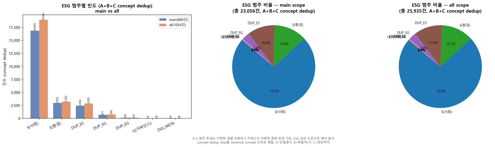
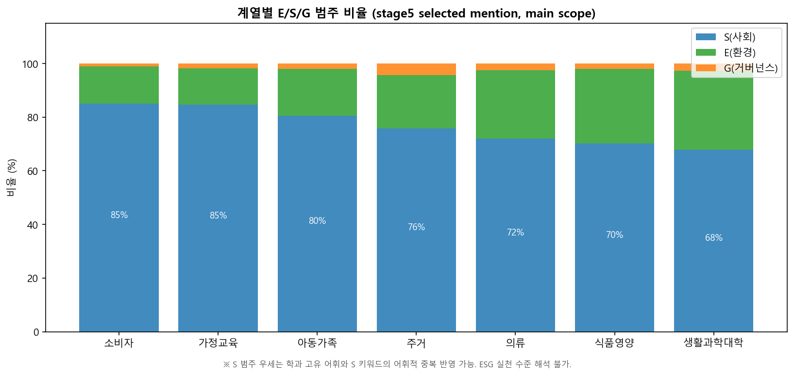
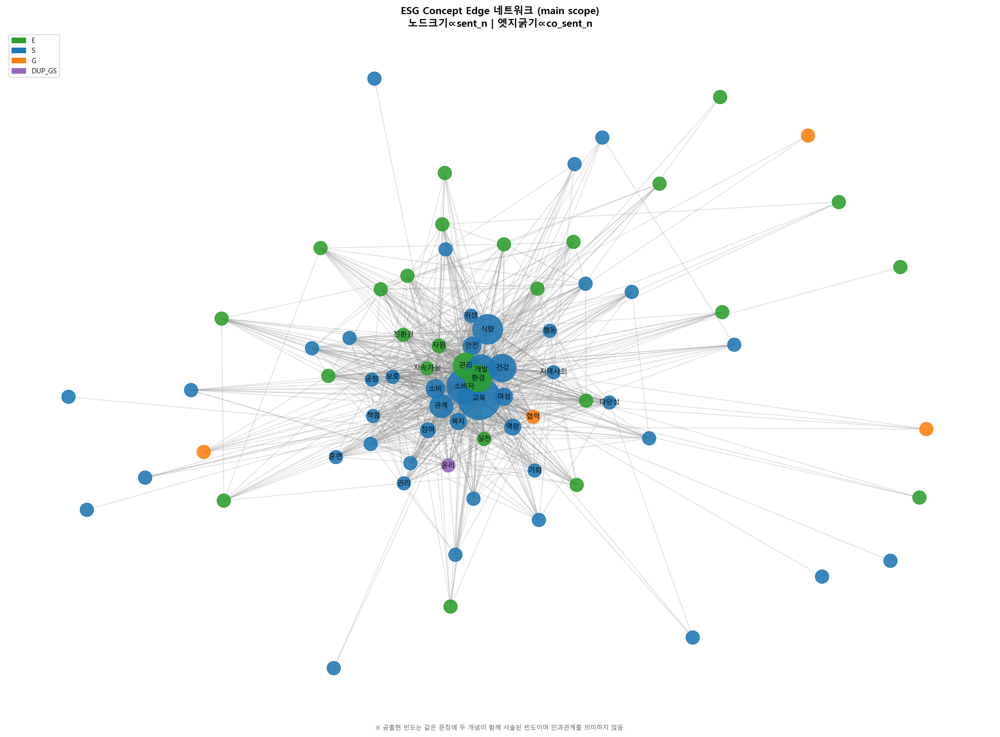
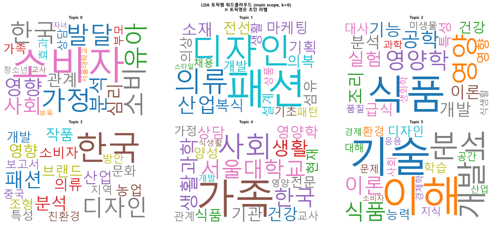

# 수도권 대학 생활과학계열 ESG 키워드 텍스트마이닝

[](https://python.org)
[]()
[]()
[]()

> 개인연구의뢰 | 단독 수행 | 18개 대학 · 1,054건 · 23,056건 언급 · k=6 LDA 6종 토픽

---

## 🎯 핵심 발견

* S 범주 73% 압도적 — 가정학·생활과학 계열 전공 어휘와 S 범주 키워드의 어휘적 접합 구조 확인, 단순 빈도 해석 지양 원칙으로 전환
* 계열별 ESG 언급 밀도 차이 확인 — 가정교육 계열 문서당 54.0회·1,000자당 19.4로 최다, 생활과학대학(E 29.6%)·식품영양(E 27.8%)에서 E 범주 비중 상대적으로 높음
* LDA k=6 토픽에서 의류 계열 집중 토픽(T1, 토픽 집중도 0.758) 가장 뚜렷한 주제 집중도 확인 — T5(기술/개발)는 토픽 집중도 0.648로 범학과적 혼합 토픽 성격

---

## 📌 프로젝트 배경

* ESG 경영 기조가 기업 중심에서 교육기관으로 확산 — 대학 교육 콘텐츠의 ESG 반영 현황을 실증 분석한 국내 연구 부재
* 수도권 18개 대학 생활과학계열 홈페이지 텍스트를 기반으로 ESG 키워드 분포와 계열별 서술 특성을 탐색하는 예비조사 수행
* 대학 교수 연구 논문 분석 의뢰로 수행

---

## 🔍 분석 설계

**분석 질문**

수도권 18개 대학 생활과학계열 홈페이지 텍스트에서 ESG 키워드가 어떻게 분포하는가. 계열별로 ESG 언급 구성과 밀도에 차이가 존재하는가.

**접근 방식**

ESG 키워드 사전 수작업 구축 후 단일어·복합어·영문약어 3종 병렬 집계 — 빈도분석·공동출현 네트워크·LDA 토픽모델링 4단계 파이프라인으로 탐색적 분석 수행.

---

## ⚠️ 문제 상황

대학 교육 현황 진단에서 세 가지 구조적 어려움 존재.

| 문제 | 내용 |
|------|------|
| 정형화된 데이터 부재 | 대학 홈페이지는 비정형 텍스트로 구성, 체계적 비교 분석 기준 없음 |
| 노이즈 비중 | 공지·게시판·교수 약력 등 ESG와 무관한 페이지가 전체의 상당 비중 차지 |
| 키워드 기준 부재 | 생활과학계열에 특화된 ESG 키워드 분류 체계 없음 |

---

## 🛠️ 분석 과정

### 1️⃣ 크롤링 & 전처리

* 수도권 18개 대학 생활과학계열 학과 홈페이지 크롤링(BeautifulSoup) — 전체 수집 1,054건 중 공지사항·게시판·교수 약력 등 ESG 분석과 무관한 페이지를 제거해 분석 대상 866건 선별
* KoNLPy Okt로 형태소 분석 후, "성평등" 같은 복합어가 있을 때 "성"+"평등"으로 따로 세지 않고 복합어 전체를 하나의 단위로 우선 처리

**결과:** 1,054건 수집 → 866건 정제 완료, ESG 복합어 우선 처리 구조 확립

---

### 2️⃣ 빈도분석

* 3가지 유형(단일어·복합어·영문약어) 병렬 집계 — 같은 ESG 개념을 가리키는 여러 표현은 대표 키워드로 통합 집계
* 대학별·계열별로 문서당 언급 횟수와 텍스트 1,000자당 언급 수 산출 — 대학·학과별 문서 분량 차이를 보정해 계열 간 비교 가능한 지표로 환산

**결과:** S 범주 73% 압도적, 계열별 언급 밀도 차이 확인 — 가정교육 계열 최다, E 범주는 생활과학대학·식품영양·의류 계열에서 상대적으로 높음

---

### 3️⃣ 공동출현 네트워크

* 같은 문장 안에서 함께 등장한 ESG 키워드 쌍을 집계 — "개발"과 "교육"이 한 문장에 나오면 연결 관계로 기록, "성평등"과 "평등"처럼 포함 관계인 키워드 쌍은 중복 집계 차단
* 두 키워드가 각각 얼마나 자주 나오는지를 함께 고려해 단순 공출현 빈도를 보정(Ochiai 계수) — 텍스트 전반에 자주 등장하는 단어끼리의 당연한 공출현을 걸러 실질 연관성 측정

**결과:** 81개 노드·866개 edge 네트워크 구성 — 개발–교육 쌍 최다 공출현, 교육·소비자·식량·환경이 전 계열 공통 핵심 노드

---

### 4️⃣ LDA 토픽모델링

* ESG 키워드만 넣으면 단어 종류가 너무 적어 토픽 구분이 어려워지므로 전체 어휘로 입력
* coherence 수치·해석 가능성·데이터 분량 대비 적절한 토픽 수를 기준으로 k=6 선택(coherence 0.5147) — 비슷한 coherence 구간의 토픽 수를 직접 검토해 해석 가능한 최적 수 확정
* 계열별·수집 페이지 종류별 토픽 분포 분석

전환점: S 범주 73% 발견 후 가정학·생활과학 계열 전공 어휘와 S 범주 키워드의 구조적 겹침 확인 — 빈도 자체가 아닌 어휘적 접합 구조를 해석 원칙으로 설정 후 계열별·페이지 종류별 분석으로 전환.

**결과:** k=6 6토픽 구조화 완료 — 의류 계열 집중 토픽(T1) 집중도 0.758 최고, T5 기술/개발은 범학과 혼합 토픽

---

## 📊 핵심 결과

### ESG 범주 분포



| 범주 | 건수(main) | 비율 |
|------|-----------|------|
| S 사회 | 16,829 | 73.0% |
| E 환경 | 2,952 | 12.8% |
| E·S 공통 | 2,442 | 10.6% |
| G 거버넌스 | 19 | 0.1% |

* S 범주 73% 압도적, E 12.8%, E·S 공통 10.6%, G 0.1%
* 상위 키워드: 교육(4,672건) > 소비자(4,000건) > 식량(1,799건) > 개발(1,791건) > 건강(1,387건)

### 계열별 ESG 언급 구성



| 계열 | 문서당 언급 | 1,000자당 언급 | E 비중 |
|------|-----------|----------------|--------|
| 가정교육 | 54.0회 | 19.4 | 13.5% |
| 소비자 | 45.6회 | 14.0 | 13.9% |
| 생활과학대학 | 20.4회 | 10.2 | 29.6% |
| 식품영양 | 15.3회 | 3.6 | 27.8% |
| 의류 | 18.0회 | 6.3 | 25.5% |

* 가정교육·소비자 계열 언급 밀도 최다 — S 범주 전공 어휘 접합 구조 영향
* 생활과학대학(E 29.6%)·식품영양(E 27.8%)·의류(E 25.5%) 계열에서 E 범주 비중 상대적으로 높음

### 공동출현 네트워크



* 81개 노드·866개 edge
* 최다 공출현 쌍: 개발–교육(311건, Ochiai 0.177)·교육–환경(227건)·교육–소비자(225건)
* 전 계열 공통 핵심 노드: 교육(2,587개 문장)·소비자(1,752개)·식량(1,230개)·환경(994개)

### LDA 토픽 구조 (main, k=6)



| 토픽 | 주요 단어 | 문서수(비율) | 토픽 집중도 |
|------|-----------|------------|---------|
| T0 소비자·가정 | 소비자·소비·가정·발달 | 139건(16.1%) | 0.724 |
| T1 패션·의류 | 패션·디자인·의류·산업 | 120건(13.9%) | 0.758 |
| T2 식품·영양 | 식품·영양·영양학·공학 | 171건(19.8%) | 0.729 |
| T3 의류·연구 | 한국·디자인·패션·분석 | 98건(11.3%) | 0.704 |
| T4 가족·사회 | 가족·사회·생활과학·상담 | 196건(22.6%) | 0.694 |
| T5 기술·개발 | 기술·이해·분석·개발 | 142건(16.4%) | 0.648 |

* T1(의류·산업) 토픽 집중도 0.758 — 6개 토픽 중 가장 뚜렷한 주제 집중도 확인
* T5(기술·개발)는 범용 교육 어휘(기술·이해·분석·학습)가 집합된 혼합 토픽 성격 — 토픽 집중도 0.648로 최저

---

## 💡 적용 가능성

* 대학 ESG 교육 현황 정기 진단 지표로 활용
* 학과 개편·교육과정 설계 시 ESG 서술 강도 비교 기초 데이터로 활용
* 동일 방법론을 타 계열(공학·경영 등) 또는 기업 채용 공고 텍스트로 확장 적용

---

## 📈 한계점 및 향후 연구 방향

**한계점**

* S 범주 키워드(교육·건강·복지·소비자 등)는 가정학 계열 전공 어휘와 어휘적으로 중복 — ESG 맥락이 아닌 일반 학과 서술에서도 카운트되는 false positive 발생 가능
* ESG 키워드 사전 기반 분석 — 사전에 등재되지 않은 ESG 관련 표현 포착 불가
* 탐색적 예비조사 성격 — 결과의 일반화에 한계, 향후 Moreno & Caminero(2022) lexicon 반복 정제 방식 적용 필요
* '법'·'물' 키워드 전면 제외 — false positive 비율이 높아 제외했으나 '물 부족'·'물 절약' 등 E 범주 표현도 함께 누락되는 false negative 발생

**개선 방향**

* 단기: 계열별 false positive 키워드 수동 정제 적용
* 중기: ESG 키워드 사전 타 계열 확장 및 전국 대학으로 분석 범위 확대
* 장기: 연도별 홈페이지 텍스트 추이 분석 체계 구축 및 대학 ESG 서술 변화 모니터링 자동화

---

## 👥 역할

* 단독 수행 — 크롤링 설계, 문서 정제 파이프라인 구축, ESG 키워드 사전 수작업 구축, 빈도·TF-IDF·공동출현 네트워크·LDA 토픽모델링 전 과정 구현

---

## 🔧 기술 스택

| 분류 | 도구 |
|------|------|
| 크롤링 | BeautifulSoup, requests |
| 형태소 분석 | KoNLPy Okt |
| 텍스트 분석 | TF-IDF(sklearn), Ochiai 계수 |
| 토픽모델링 | LDA(gensim) |
| 네트워크 분석 | NetworkX |
| 시각화 | Matplotlib, WordCloud |

---

## 📁 파일 구조

```text
08_esg_textmining/
├── code/
│   ├── 01_crawling/
│   │   └── c-1.ipynb                  # 18개 대학 크롤링
│   ├── 02_modeling/
│   │   ├── m-1.ipynb                  # ESG 키워드 빈도 분석
│   │   └── m-2.ipynb                  # TF-IDF 분석
│   └── 03_v2/                         # 최종 파이프라인
│       ├── 단계1_문서선별전처리/
│       ├── 단계2_빈도분석/
│       └── 단계3_연관분석/
├── docs/images/                       # 분석 결과 시각화
└── README.md
```

---

## 📊 데이터 안내

크롤링 원본 데이터(CSV)는 용량 문제로 레포에 포함되어 있지 않음. 분석 파이프라인 코드와 시각화 결과만 공개.
